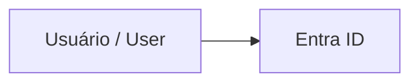

# Pedro Soucheff — Segurança e Identidade no ecossistema Microsoft

[](https://github.com/soucheff/soucheff.github.io/actions/workflows/deploy.yml)
[](https://soucheff.github.io)
[](LICENSE)
[](LICENSE-content)

Site pessoal de **Pedro Soucheff** — artigos técnicos e demonstrações práticas sobre
**Microsoft Entra ID**, **Zero Trust**, **IAM**, **Microsoft Defender** e segurança em Azure.
Conteúdo em **PT-BR** (padrão) e **EN**.

> 🌐 Acesse em **https://soucheff.github.io**

---

## Stack

| Camada | Tecnologia |
| --- | --- |
| Gerador estático | [Astro 4](https://astro.build) + TypeScript |
| Conteúdo | Markdown / MDX (Content Collections + Zod) |
| Realce de código | [Shiki](https://shiki.style) (dual-theme light/dark) |
| Diagramas | [Mermaid](https://mermaid.js.org) via `rehype-mermaid` (SVG inline, zero JS no cliente) |
| Ilhas interativas | [React](https://react.dev) via `@astrojs/react` |
| Estilo | [Tailwind v3](https://tailwindcss.com) + tokens CSS (paleta Microsoft) |
| Busca | [Pagefind](https://pagefind.app) (client-side, pós-build) |
| Hosting | GitHub Pages via GitHub Actions |

---

## Como adicionar um artigo

1. Crie um arquivo em `src/content/articles/<slug>.md`. Use kebab-case no nome (ex.: `entra-id-mfa.md`).
2. Use o template de frontmatter abaixo. O bloco `i18n.pt` é **obrigatório**; `i18n.en` é opcional
   (sem ele, o artigo só publica em português).
3. Escreva o corpo dividindo as línguas com directives `:::lang{pt}` e `:::lang{en}`.
   Blocos **sem** marca de idioma (ex.: blocos de código, Mermaid) aparecem em **ambas** as versões.
4. `npm run dev` e acesse `http://localhost:4321/artigos/<slug>` para revisar PT, e
   `http://localhost:4321/en/articles/<slug>` para EN.
5. Abra um PR a partir de uma branch `feature/artigo-<slug>`.

### Template — `src/content/articles/<slug>.md`

```markdown
---
pubDate: 2026-05-16
author: Pedro Soucheff
tags:
  - entra-id
  - zero-trust
i18n:
  pt:
    title: Título em português
    description: Descrição curta (1–2 linhas) em português.
  en:
    title: Title in English
    description: Short description (1–2 lines) in English.
---

:::lang{pt}
## Introdução

Conteúdo em português...
:::

:::lang{en}
## Introduction

Content in English...
:::

<!-- Blocos sem :::lang{} aparecem em AMBAS as línguas (ex.: código e diagramas). -->



```powershell
New-MgIdentityConditionalAccessPolicy ...
```
```

### Convenções

- **Slug**: kebab-case, mesmo nome de arquivo (sem extensão) é a URL.
- **Tags**: lowercase-kebab-case (`entra-id`, `zero-trust`, `microsoft-defender`).
- **Datas**: ISO (`YYYY-MM-DD`). Use `updatedDate` para revisões posteriores.
- **Drafts**: `draft: true` no frontmatter — visível em dev, oculto em produção.

---

## Como adicionar uma demo

Praticamente igual a um artigo, mas em `src/content/demos/<slug>.mdx`, com campos extras
para a stack e links da demo. MDX permite importar componentes React para interatividade.

### Template — `src/content/demos/<slug>.mdx`

```mdx
---
pubDate: 2026-05-16
author: Pedro Soucheff
tags: [demo, react]
tech: [Astro, React, TypeScript]
repoUrl: https://github.com/soucheff/algum-repo
liveUrl: https://exemplo.com
i18n:
  pt:
    title: Nome da demo em português
    description: O que ela demonstra.
  en:
    title: Demo name in English
    description: What it demonstrates.
---

import MeuComponente from '@/components/demo/MeuComponente.tsx';

:::lang{pt}
## Sobre a demo
Explicação em português...
:::

:::lang{en}
## About the demo
Explanation in English...
:::

<MeuComponente client:visible />
```

Diretivas de hidratação React: `client:load`, `client:visible`, `client:idle`, `client:only`.
Prefira `client:visible` para componentes pesados.

---

## Imagens e assets

Imagens dos artigos vivem em `public/images/articles/<slug>/` e são referenciadas por caminho
absoluto (ex.: `/images/articles/modern-auth-01/basicAuth-Flow.png`). Imagens externas (YouTube
thumbnails, diagramas hospedados em outro lugar) podem ser usadas via URL direta.

### Otimizar imagens

O repositório inclui um otimizador baseado em [sharp](https://sharp.pixelplumbing.com) que
redimensiona (largura máxima de 1600 px) e recomprime PNG/JPEG **in-place**, substituindo o
original apenas se o resultado ficar menor (idempotente — seguro para rodar várias vezes):

```powershell
npm run optimize:images
```

O script percorre `public/images/**/*.{png,jpg,jpeg}`, aplica paleta + compressão nível 9 em
PNGs e mozjpeg q82 progressivo em JPEGs, e imprime um relatório de redução por arquivo. Rode
antes de commitar imagens novas — em PNGs de diagrama é típico ver **-65% a -77%** de redução
sem perda visual perceptível.

---

## Rodando localmente

```powershell
# Pré-requisitos: Node 20 LTS (veja .nvmrc) e npm.
npm ci
npm run dev        # http://localhost:4321
npm run build      # gera dist/ + indexa com Pagefind
npm run preview    # serve dist/ para testar
```

Em primeira instalação, o build executa `playwright install chromium` automaticamente quando
o `rehype-mermaid` precisa renderizar diagramas. Se preferir pular Mermaid em dev, basta não
incluir blocos `mermaid` no conteúdo em edição.

---

## Estrutura do projeto

```
soucheff.github.io/
├── .github/
│   ├── workflows/deploy.yml        # CI/CD para GitHub Pages
│   ├── ISSUE_TEMPLATE/             # formulários de issues
│   ├── CODEOWNERS
│   └── pull_request_template.md
├── public/                         # assets estáticos (favicon, robots, imagens)
├── scripts/
│   ├── postbuild-i18n-pagefind.mjs # injeta data-pagefind-ignore por idioma
│   └── optimize-images.mjs         # otimizador PNG/JPEG via sharp (npm run optimize:images)
├── src/
│   ├── components/                 # Header, Footer, ThemeToggle, Cards, demo/*
│   ├── content/
│   │   ├── config.ts               # schemas Zod (articles, demos)
│   │   ├── articles/<slug>.md      # artigos bilíngues
│   │   └── demos/<slug>.mdx        # demos bilíngues (com React opcional)
│   ├── layouts/                    # BaseLayout, ArticleLayout, DemoLayout
│   ├── lib/
│   │   ├── i18n.ts                 # strings de UI + helpers de locale
│   │   ├── content.ts              # queries de coleções
│   │   └── remark-i18n-directive.mjs # plugin :::lang{}
│   ├── pages/
│   │   ├── index.astro             # home PT
│   │   ├── artigos/                # PT
│   │   ├── demos/                  # PT
│   │   ├── tags/                   # PT
│   │   ├── buscar.astro            # PT (Pagefind UI)
│   │   ├── en/                     # espelho EN (/en/articles, /en/demos, ...)
│   │   └── 404.astro
│   └── styles/
│       ├── tokens.css              # paleta Microsoft (CSS vars)
│       └── global.css              # Tailwind base + componentes
├── astro.config.mjs
├── tailwind.config.mjs
├── tsconfig.json
└── package.json
```

---

## Deploy

Todo push em `main` dispara o workflow [`.github/workflows/deploy.yml`](.github/workflows/deploy.yml):

1. Checkout
2. Setup Node (lê `.nvmrc`) + `npm ci`
3. `npx playwright install --with-deps chromium` (necessário para Mermaid inline-svg)
4. `npm run build` (Astro → Astro check → post-process i18n → Pagefind index)
5. Upload do artifact `dist/`
6. Job de deploy → `actions/deploy-pages@v4` publica em `https://soucheff.github.io`

> **Settings → Pages**: a *source* deve estar configurada como **GitHub Actions** (não "Deploy from a branch").

---

## Identidade visual

Paleta inspirada no design Microsoft, foco em **segurança corporativa**:

| Token | Hex | Uso |
| --- | --- | --- |
| `--color-bg` (escuro) | `#0F172A` | Fundo principal (Midnight Navy) |
| `--color-primary` | `#0078D4` | Links, botões, destaque (Azure Blue) |
| `--color-accent` | `#22C55E` | Badges e indicadores positivos (Security Green) |
| `--color-surface` | `#1F2937` | Cards e blocos de código |
| `--color-text` | `#E5E7EB` | Texto principal no tema escuro |
| `--color-text-muted` | `#6B7280` (claro) / `#9CA3AF` (escuro) | Texto secundário |

Modo claro derivado automaticamente; toggle persistente em `localStorage` com fallback em
`prefers-color-scheme`.

---

## Contribuindo

- **Issues**: use os formulários em "New issue" — há templates para sugerir artigos, sugerir demos,
  reportar erro de conteúdo e bug do site.
- **Pull Requests**: usam o template em [`.github/pull_request_template.md`](.github/pull_request_template.md).
- **Reviewers**: `@soucheff` é o code owner padrão (ver [`.github/CODEOWNERS`](.github/CODEOWNERS)).
- **Discussões abertas**: aba [Discussions](https://github.com/soucheff/soucheff.github.io/discussions).

---

## Licenças

- **Código** (Astro, TypeScript, componentes, scripts): [MIT](LICENSE)
- **Conteúdo** (artigos, demos, textos editoriais sob `src/content/`): [CC BY 4.0](LICENSE-content) —
  reutilize livremente com atribuição a *Pedro Soucheff* e link para o artigo original.

---

## Contato

- GitHub: [@soucheff](https://github.com/soucheff)
- Site: [soucheff.github.io](https://soucheff.github.io)
