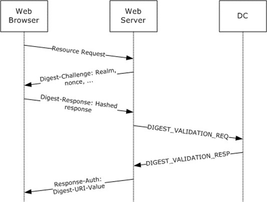
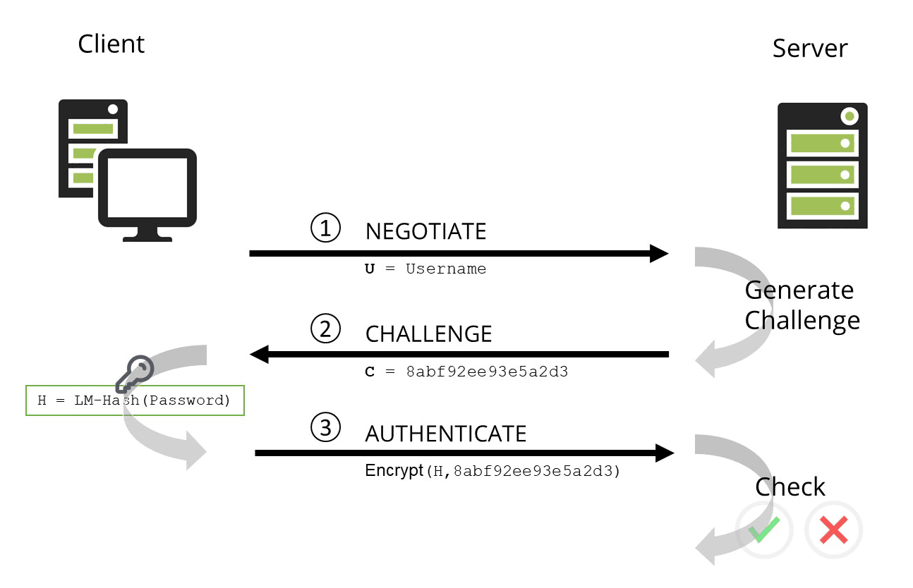

# Modern Authentication - Autorização e Autenticação: conceitos e aplicações na plataforma Entra ID (Parte 1 de 6)

**Note:** Esse artigo faz parte de uma série artigos que irá abordar os conceitos de autenticação e autorização e as funcionalidades da família [Microsoft Entra](https://learn.microsoft.com/en-us/entra/): 

* Microsoft Entra ID
* Microsoft Entra ID Protection 
* Microsoft Entra ID Governance
* Microsoft Entra External ID / Azure AD B2C
* Microsoft Entra Internet Access / Microsoft Entra Private Access
* Microsoft Entra Permission Management
* Microsoft Entra Verfified ID
* Microsoft Entra Workload ID

## Introdução
A internet é um espaço de interação e troca de informações entre diversos agentes, como usuários, aplicativos, serviços e recursos. Para garantir a segurança e a privacidade dessas interações, é necessário estabelecer mecanismos de autenticação e autorização que verifiquem a identidade e o acesso dos agentes envolvidos. Os protocolos modernos mais utilizados para esse fim são o **OpenID Connect(OIDC)**, **Open Authentication(OAuth)** e **Security Assertion Markup Language(SAML)**. Esses protocolos objetivam permitir que um aplicativo obtenha acesso limitado a um recurso protegido em nome de um usuário, sem que este tenha que compartilhar suas credenciais com o aplicativo.

O objetivo desta série de artigos é apresentar os conceitos e as aplicações dos protocolos **SAML**, **OAuth** e **OIDC** usando como IAM o [**Entra ID**](https://learn.microsoft.com/en-us/entra/identity/), explicando como eles operam, quais são os seus benefícios e desafios, e como eles podem ser implementados em diferentes cenários. A tese defendida neste artigo é que o **OAuth** e o **OIDC** são protocolos flexíveis, seguros e eficientes para a gestão de autenticação e autorização na internet, mas que também requerem cuidados e boas práticas para evitar vulnerabilidades e riscos.

O artigo foi divido em 6 seções:
* **Seção 1, será feita uma revisão teórica sobre os conceitos de autenticação e autorização, bem como sobre o histórico e a evolução do **protocolo de autenticação e autorização**.**
* Seção 2, será descrito o funcionamento do **SAML**, explicando os seus principais componentes, fluxos e especificações.
* Seção 3, será descrito o funcionamento do **OAuth**, explicando os seus principais componentes, fluxos e especificações.
* Seção 4, será descrito o funcionamento do **OpenID Connect**, explicando os seus principais componentes, fluxos e especificações.
* Seção 5, serão apresentados alguns exemplos de aplicações usando **SAML**, **OAuth** e **OIDC** em diferentes contextos, como redes sociais, serviços de nuvem e dispositivos móveis.
* Seção 6, serão discutidos os benefícios e os desafios do **SAML**,**OAuth** e **OIDC**, analisando as suas vantagens e desvantagens, bem como as suas recomendações e limitações.

## Seção 1 - Revisão teorica e conceitos de autenticação e autorização e sua evolução

>Termos: 
> * Authentication => AuthN
> * Authrorization => AuthZ
> * Identity Access Manegament => IAM
> * Identity Provider => IdP
> * Service Provider => SP
> * Single Sign-On => SSO

### Conceitos de Autenticação e Autorização
A Autenticação(AuthN) é o processo de identitificar o agente, ou seja responder a perguntar "Who are you?".

Já o processo de Autorização(AuthZ) é a validação se o agente tem da permissão de acesso aos recursos solicitados, "Can you do that?".

## Autenticação Legada
Iremos definir como autenticação legada os modelos baseado Esse processo de autenticação de um usuário normalmente é baseado em apenas um fator como por exemplo usuário e senha
Temos alguns protocolos bem conhecidos como: 

    * NTLM
    * Kerberos 
    * Basic Authentication 
    * Digest Authentication
    
Nesse tipo de fluxo de autenticação e autorização as aplicações realizam o processo de autenticação o que eleva a complexidade da manutenção de segurança e implementações de novas camadas de segurança.

### Basic Authentication
O Basic Authentication é o sistema de autenticação mais comum do protocolo HTTP definido pela [RFC 7617](https://datatracker.ietf.org/doc/html/rfc7617). 

How it works:

1. Quando um usuário tenta acessar um recurso protegido, ele é solicitado a fornecer um nome de usuário e uma senha.

2. Essas informações são então enviadas para o servidor, que verifica se as credenciais são válidas.

3. O servidor responde ao cliente com o código HTTP 401 (Unauthorized) e um cabeçalho WWW-Authenticate, que fornece informações sobre como se autenticar.

4. O cliente envia o pedido com o cabeçalho de autenticação no formato: Authorization: 
    * Basic {credenciais em base 64 no formato usuário:senha}. 
    
    Lembre-se de que o Base 64 é um esquema de codificação, **não criptografia**.

    Se as credenciais estiverem corretas, o cliente receberá uma resposta diferente de 403 (Forbidden).

É importante observar que o uso do Base 64 se deve ao padrão MIME. Portanto, o Basic Authentication deve ser utilizado apenas com uma conexão **HTTPS (TLS) para garantir a segurança**. No entanto, mesmo com HTTPS, o Basic Auth não é 100% seguro, pois as credenciais são enviadas a cada requisição. A autenticação também pode ser permanentemente armazenada no navegador, se necessário, mas isso é raro em RESTful APIs.

Em resumo, o Basic Authentication é simples e de rápida implementação, mas sua segurança depende do nível de risco dos dados em trânsito via HTTP. 

Para dados sigilosos, outras opções de autenticação, como OAuth ou OAuth2, podem ser mais adequadas

Fontes:
[Microsoft - Basic Authentication in ASP.NET Web API](https://learn.microsoft.com/en-us/aspnet/web-api/overview/security/basic-authentication)

[Mozilla - HTTP Authentication](https://developer.mozilla.org/en-US/docs/Web/HTTP/Authentication)

[RFC2617 - HTTP Authentication](https://datatracker.ietf.org/doc/html/rfc2617)

### Digest Authentication
A Digest Authentication, conforme definida na [RFC 7616](https://datatracker.ietf.org/doc/html/rfc7616), é um método pelo qual um servidor da web pode negociar credenciais, como nome de usuário ou senha, com o navegador da web de um usuário. 

Ela é usada para confirmar a identidade de um usuário antes de enviar informações sensíveis, como o histórico de transações bancárias online. **Diferentemente do Basic Authentication esse metódo calcula o HASH do usuário e senha antes de enviar ao site.** 

Hashing e Nonce: A autenticação Digest aplica uma função hash ao nome de usuário e à senha antes de enviá-los pela rede.
    
Isso é diferente da autenticação básica, que usa a codificação Base64 facilmente reversível em vez do hash, tornando-a não segura, a menos que seja usada em conjunto com o TLS (Transport Layer Security).

**Processo de Autenticação:**
1. O cliente faz uma solicitação de informações, enviando um nome de usuário e senha para o servidor.

1. O servidor gera um valor nonce (número usado apenas uma vez) e o envia ao cliente.

1. O cliente calcula o hash da senha e outras informações (como o método HTTP e o URI solicitado) usando o nonce.

1. O cliente envia a resposta ao servidor no formato: Authorization: Digest username="usuário", realm="realm", nonce="nonce", uri="URI", response="hash".

1. O servidor verifica a resposta e concede acesso se tudo estiver correto.

1. Segurança e Obsolescência: A autenticação Digest é mais segura em trânsito do que a Basic Authentication. No entanto, ela foi considerada obsoleta desde julho de 2011.

Em resumo, a autenticação Digest é uma alternativa à autenticação básica, oferecendo maior segurança ao usar hashes e nonces para proteger as credenciais do usuário durante a comunicação com o servidor.

Fontes:
[Microsoft - Digest Authentication](https://learn.microsoft.com/en-us/iis/configuration/system.webserver/security/authentication/digestauthentication)
[Microsoft - Protocols - Digest Validation Protocol](https://learn.microsoft.com/en-us/openspecs/windows_protocols/ms-apds/a560b639-09a6-4218-bd2b-bc0d85381e24)

### NTLM

O NTLM (NT LAN Manager) é um protocolo de autenticação desafio-resposta usado em sistemas Windows. 

1. Protocolo NTLM:
    * O NTLM inclui várias versões, como LAN Manager versão 1 e 2, e NTLM versão 1 e 2.
    * Ele autentica usuários e computadores com base em um mecanismo de desafio/resposta.
    * O servidor ou controlador de domínio verifica se o usuário conhece a senha associada à conta.

1. Processo de Autenticação:
    * Quando um usuário tenta acessar um recurso protegido, o servidor gera um desafio.
    * O cliente (usuário ou computador) responde ao desafio com um hash da senha.
    * O servidor verifica o hash e concede acesso se for válido.

1. Aplicações Atuais:
    * O NTLM ainda é usado para autenticação do Windows em sistemas configurados como membros de um grupo de trabalho.
    * Também é usado para autenticação de logon local em controladores que não são de domínio.
    
1. Segurança e Limitações:
    * O NTLM tem vulnerabilidades de segurança e problemas de compatibilidade.
    * O Kerberos versão 5 é o método preferencial para ambientes do Active Directory, mas aplicativos não-Microsoft ainda podem usar o NTLM.

Em resumo, o NTLM é um protocolo de autenticação legado que deve ser usado com cautela, considerando suas limitações e riscos de segurança

### Kerberos

O Kerberos é um protocolo de autenticação de rede desenvolvido pelo Massachusetts Institute of Technology (MIT) na década de 1980. Ele fornece um método seguro para autenticar usuários e serviços em uma rede, garantindo que apenas usuários autorizados tenham acesso aos recursos.

A autenticação Kerberos é um processo de várias etapas que envolve os seguintes componentes:

* Cliente: O cliente inicia a necessidade de uma solicitação de serviço em nome do usuário.
* Servidor: O servidor hospeda o serviço ao qual o usuário precisa acessar.
* AS (Authentication Server): O AS executa a autenticação do cliente.
* KDC (Key Distribution Center) e seus três componentes:
* TGS (Ticket Granting Server): Emissor de bilhetes de serviço.
* Banco de Dados Kerberos: Armazena informações de autenticação.

O Kerberos é amplamente usado em sistemas operacionais populares, incluindo o Windows, e é integrado a aplicativos de software e sistemas operacionais. Ele se tornou um componente crítico da infraestrutura de TI, sendo a tecnologia de autorização padrão no Microsoft Windows. O Kerberos utiliza autorização de bilhete de terceiros e criptografia forte para dificultar que hackers obtenham acesso a uma rede corporativa. Com o Kerberos, as organizações podem acessar a internet sem comprometer sua segurança.

Em resumo, o Kerberos oferece uma solução confiável para autenticação em redes distribuídas, garantindo a proteção dos dados confidenciais e a autenticação segura de usuários e serviços

Fontes:
[Microsoft - Kerberos AUthentication Overview](https://learn.microsoft.com/pt-br/windows-server/security/kerberos/kerberos-authentication-overview)

## Autenticação moderna

A autenticação moderna é um termo guarda-chuva que engloba uma combinação de métodos de autenticação e autorização entre um cliente (como um laptop ou telefone) e um servidor, juntamente com medidas de segurança baseadas em políticas de acesso. 

Vamos explorar os detalhes, protocolos e utilizações da autenticação moderna:

Métodos de Autenticação:

* MFA (Autenticação Multifator): Requer que o usuário forneça mais de uma forma de autenticação (por exemplo, senha e código enviado por SMS).

* Autenticação com Smart Card: Utiliza cartões inteligentes (geralmente inseridos em leitores USB) para autenticar usuários.

* Autenticação Baseada em Certificado do Cliente: Usa certificados digitais para autenticar dispositivos ou aplicativos.

* OAuth (Open Authorization): Protocolo de autorização que permite que aplicativos acessem recursos em nome do usuário.

Políticas de Acesso Condicional:

* MAM (Gerenciamento de Aplicativos Móveis): Define políticas para controlar o acesso a aplicativos móveis com base em fatores como localização, dispositivo e usuário.

* Acesso Condicional da Microsoft: Permite que os administradores definam regras para permitir ou negar o acesso com base em condições específicas.

Aplicações e Ambientes:

* Office 365 e Exchange: A autenticação moderna está disponível para implantações híbridas do Skype for Business e servidores locais do Exchange.

* Skype for Business e Exchange: O comportamento dos usuários do Skype for Business é afetado pelo status de autenticação moderna do Exchange.

* Ambientes Híbridos e Domínio Dividido: Aplica-se a cenários com Skype for Business Online e local, com usuários em ambos os locais.

Em resumo, a autenticação moderna oferece métodos mais seguros de gerenciamento de identidades e proteção de recursos, tanto para ambientes no local quanto para ambientes híbridos do Exchange e Skype for Business