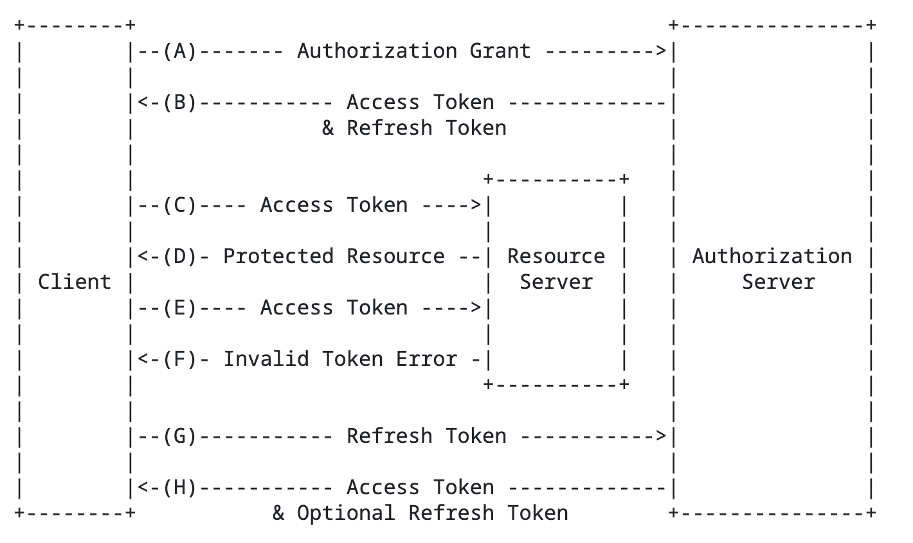

# SAML2/OAuth/OpenID Connect - Autorização e Autenticação: conceitos e aplicações na plataforma Entra ID (Parte 3 de 6)

**Note:** Esse artigo faz parte de uma série artigos que irá abordar os conceitos de autenticação e autorização e as funcionalidades da família [Microsoft Entra](https://learn.microsoft.com/en-us/entra/): 

* Microsoft Entra ID
* Microsoft Entra ID Protection 
* Microsoft Entra ID Governance
* Microsoft Entra External ID / Azure AD B2C
* Microsoft Entra Internet Access / Microsoft Entra Private Access
* Microsoft Entra Permission Management
* Microsoft Entra Verfified ID
* Microsoft Entra Workload ID

## Introdução
A internet é um espaço de interação e troca de informações entre diversos agentes, como usuários, aplicativos, serviços e recursos. Para garantir a segurança e a privacidade dessas interações, é necessário estabelecer mecanismos de autenticação e autorização que verifiquem a identidade e o acesso dos agentes envolvidos. Os protocolos modernos mais utilizados para esse fim são o **OpenID Connect(OIDC)**, **Open Authentication(OAuth)** e **Security Assertion Markup Language(SAML)**. Esses protocolos objetivam permitir que um aplicativo obtenha acesso limitado a um recurso protegido em nome de um usuário, sem que este tenha que compartilhar suas credenciais com o aplicativo.

O objetivo deste artigo é apresentar os conceitos e as aplicações dos protocolos **SAML**, **OAuth** e **OIDC** usando como IAM o [**Entra ID**](https://learn.microsoft.com/en-us/entra/identity/), explicando como eles operam, quais são os seus benefícios e desafios, e como eles podem ser implementados em diferentes cenários. A tese defendida neste artigo é que o **OAuth** e o **OIDC** são protocolos flexíveis, seguros e eficientes para a gestão de autenticação e autorização na internet, mas que também requerem cuidados e boas práticas para evitar vulnerabilidades e riscos.

O artigo foi divido em 6 seções:
* Seção 1, será feita uma revisão teórica sobre os conceitos de autenticação e autorização, bem como sobre o histórico e a evolução do **protocolo de autenticação e autorização**. 
* Seção 2, será descrito o funcionamento do **SAML**, explicando os seus principais componentes, fluxos e especificações.
* Seção 3, será descrito o funcionamento do **OAuth**, explicando os seus principais componentes, fluxos e especificações.
* Seção 4, será descrito o funcionamento do **OpenID Connect**, explicando os seus principais componentes, fluxos e especificações.
* Seção 5, serão apresentados alguns exemplos de aplicações usando **SAML**, **OAuth** e **OIDC** em diferentes contextos, como redes sociais, serviços de nuvem e dispositivos móveis.
* Seção 6, serão discutidos os benefícios e os desafios do **SAML**,**OAuth** e **OIDC**, analisando as suas vantagens e desvantagens, bem como as suas recomendações e limitações.

## Seção 3 - Revisão teória e conceitos sobre o protocolo OAUTH

>Termos: 
> * Authentication => AuthN
> * Authrorization => AuthZ
> * Identity Access Manegament => IAM
> * Identity Provider => IdP
> * Service Provider => SP
> * Single Sign-On => SSO

### OAuth 2.0
**OAuth (Open Authorization)** é um protocolo aberto que trabalha na camada de autorização possibilitando o acesso a recursos de maneira delegada ou pela aplicação.

1. **O que é o OAuth?**
    - OAuth permite que usuário sejam autorizado nas aplicações de maneira que ela não precisem realizar essas validações.
    - É um protocolo muito utilizado tantos pelos IdPs como por SPs.
    - Nele é previsto o uso de concentimento para acesso aos recursos em nome de um usuário.
    - Trabalha na camada HTTP.
    - Tokens são formatados em JWT.
    - Há 6 tipos de fluxos previstos:
        - Authorization Code grant
        - Client Credentials grant
        - Device Code flow
        - On-Behalf-Of flow
        - Implicit Grant flow
        - Resource Owner Password Credentials grant
    - [RFC 6749](https://www.rfc-editor.org/rfc/rfc6749)

2. **Exemplo de fluxo no Entra ID**
    - Exemplo de fluxo do OAuth com Entra ID

    

3. **Funcionamento do OAuth**
    - OAuth possui normalmente quatro atores no processo:
        - **Resource Owner**: Agente que irá autorizar o acessar os dados pela aplicação
        - **Client (Application)**: Aplicação que irá realizar o acesso os dados.
        - **Resource Server**: Onde os dados que serão consumidos são disponibilizado.
        - **Authorization Server**: Recurso responsável por emitir os token autorizando o acesso.
    - Workflow:
    
        
        - (A) O client solicita a autorização para acesso aos dados localizados no Resource Server ao Authorization Server.
        - (B) O usuário depois de identificado e devidamente autorizado tem os tokens(Access Token e Refresh Token) emitidos pelo Authorization Server.
        - (C) O client em posse do Access Token envia-o para o Resource Server para obter os dados protegidos e realiza esse fluxo até a invalidade do Access Token(F)
        - (G) O client com o token invalido utiliza o Refresh Token para obtenção de novos Tokens e retornar ao item C

4. **Caracteristicas**
   - OAuth apenas atua na camada de AuthZ sendo a camada de AuthN ficando sob responsabilidade do OIDC
   - Possui diversos fluxos com caracteristicas especifica que serão abordados na seção 2
   - Tokens no formato JWT