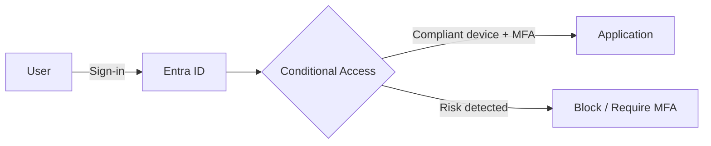

:::lang{pt}
## Introdução

Zero Trust é um modelo de segurança baseado no princípio **"nunca confie, sempre verifique"**.
Diferente do modelo perimetral clássico, ele assume que ameaças podem vir de qualquer lugar —
inclusive de dentro da rede corporativa — e exige verificação contínua de identidade, dispositivo
e contexto.

## Os três pilares essenciais

1. **Verificar explicitamente** — autenticar e autorizar com base em múltiplos sinais (identidade, dispositivo, localização, risco).
2. **Privilégio mínimo** — limitar acesso com *just-in-time* e *just-enough-access*.
3. **Assumir violação** — segmentar, criptografar de ponta a ponta, monitorar continuamente.
:::

:::lang{en}
## Introduction

Zero Trust is a security model based on the principle **"never trust, always verify"**.
Unlike the classic perimeter model, it assumes threats can come from anywhere — including from
within the corporate network — and requires continuous verification of identity, device, and context.

## The three core pillars

1. **Verify explicitly** — authenticate and authorize based on multiple signals (identity, device, location, risk).
2. **Least privilege** — limit access with *just-in-time* and *just-enough-access*.
3. **Assume breach** — segment, encrypt end-to-end, monitor continuously.
:::



:::lang{pt}
## Exemplo de política de Acesso Condicional

A política abaixo exige MFA para todos os usuários, em todas as aplicações:
:::

:::lang{en}
## Conditional Access policy example

The policy below requires MFA for all users, across all applications:
:::

```powershell
New-MgIdentityConditionalAccessPolicy `
  -DisplayName "Require MFA for all users" `
  -State "enabled" `
  -Conditions @{
      Users = @{ IncludeUsers = @("All") }
      Applications = @{ IncludeApplications = @("All") }
  } `
  -GrantControls @{
      Operator = "OR"
      BuiltInControls = @("mfa")
  }
```

:::lang{pt}
## Próximos passos

- Habilite **Security defaults** se ainda não houver políticas customizadas.
- Comece com **MFA obrigatório para administradores** e expanda gradualmente.
- Use **Sign-in logs** e **Identity Protection** para monitorar tentativas suspeitas.
- Integre **Microsoft Defender for Identity** para detectar movimento lateral.

> Zero Trust é uma jornada, não um destino. Comece pelo controle de maior impacto: identidade.
:::

:::lang{en}
## Next steps

- Enable **Security defaults** if you don't have custom policies yet.
- Start with **MFA enforced for administrators** and expand gradually.
- Use **Sign-in logs** and **Identity Protection** to monitor suspicious attempts.
- Integrate **Microsoft Defender for Identity** to detect lateral movement.

> Zero Trust is a journey, not a destination. Start with the highest-impact control: identity.
:::
